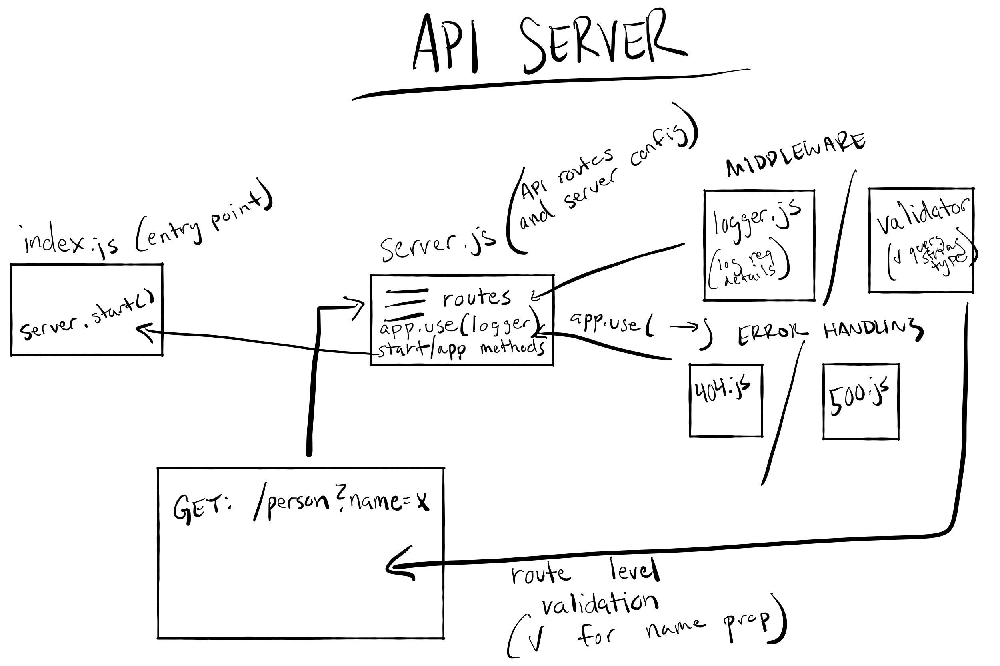

# LAB - Class 02

## Project: Basic Express Server

### Author: Cody Carpenter

### Links and Resources

- [ci/cd](https://github.com/CallMeCody/basic-express-server/actions) (GitHub Actions)
- [HEROKU APP](https://basic-express-server-lab-02.herokuapp.com/)
- [Pull Request](https://github.com/CallMeCody/basic-express-server/pull/8)

### Setup

#### `.env` requirements (where applicable)

- `PORT` - 3000

#### How to initialize/run your application (where applicable)

- `npm start`
- `nodemon`
- `node index.js`

#### How to use your library (where applicable)

#### Tests

- 404 on a bad route
- 404 on a bad method
- 500 if no name in the query string
- 200 if the name is in the query string
- if a name is in the query string, then the output object is correct

#### UML

